== Chapter 1: A Walkthrough

It is probably easier to demonstrate the features of the program rather
than trying to explain every single concept. So, here we will create a simple
American Amber Ale, touching on as many features as possible.

=== Setting Options

First, let's set a few options. Brewtarget's options are in ``Tools -> Options``.

.Select Options
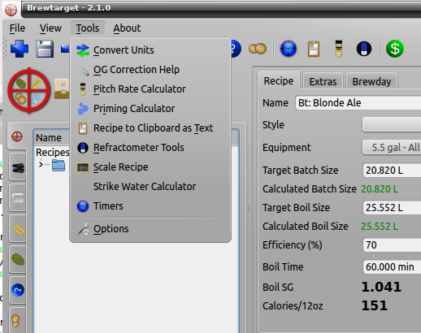

Here you should set your preferences for the unit system you wish to use, and which formulae you want to use in creating your recipes. For the purposes of this walkthrough, go to the units tab and set weight and volume to US traditional, temperature to Fahrenheit, gravity to specific gravity, and color to SRM. 

.Units
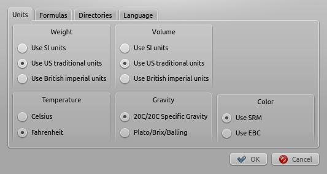

IMPORTANT: If you choose Plato for gravity, then all the displayed FG numbers
are _not_ corrected. So, the displayed FG reflects the actual FG: not what you
will see if you use your refractometer.

On the Formulas tab, set Color to "Morey's" and "IBU" to Tinseth. The screen
should look like:

.Formulas
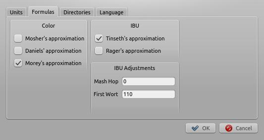

=== Defining Your Equipment

IMPORTANT: always set up an equipment profile before creating a recipe.

Having an equipment profile for your recipe is very important in Brewtarget. It contains a lot of
information about your _particular_ setup, and helps Brewtarget make better estimates.

There are three ways to create a new equipment profile. You can click
View-{gt}Equipments to open the equipment editor:

.Equipment
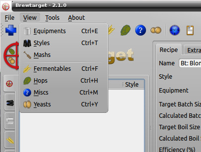

You can click the Equipment icon in the tool bar

.Equipment Toolbar
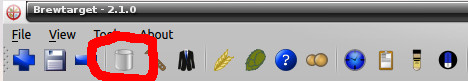

...or you can open the equipment tree. Right click and select "new".

.Equipment Tree
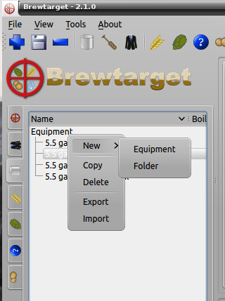

If you use the first two methods, you need to click the blue "+" at the
bottom of the window to create a new profile. After you click the plus, or if
you started from the equipment tree, you will need to provide a name for the
profile. Once you have done that, press "OK".

Fill out as many of these fields as you can.

.Equipment Fields
[cols="<25,<75a", options="header"]
|==============================================================================
|Field
|Description

|Set as Default
|Set as the default profile to be used when creating recipes

2+^h|Required Fields

|Name
|Any name you choose to title your equipment setup

|Batch size
|How much wort you want in the primary fermenter

|Pre-boil volume
|Amount of wort in the kettle immediately prior to boil. Alternatively select
"Calculate pre-boil volume" below to automatically compute this value.

|Calculate pre-boil volume
|Automatically calculate the pre-boil volume based on boil
time, losses, and water additions, instead of entering it by hand

2+^h|Boiling & Water

|Boil time
|How long you usually boil

|Evaporation rate
|Water loss during the boil, per hour. Typically, around 3L or 0.75 US gallons.

|Kettle top-up water
|Amount of water you usually add directly to the kettle
before boiling. For *extract* recipes, this should be equal to
the boil volume

|Final top-up water
|Amount of water to add to the wort immediately before going into the primary

|Grain absorption
|How many liters of water are permanently lost to each
kilogram of grain during mashing. The default value is 1.0875 liters
per kilogram. This can fluctuate due to the fine-ness of
your grind, humidity, brand, and other factors. Pressing the
"Default Absorption" button will reset the value to this
default

|Boiling Point of Water
|The temperature at which water boils. The default value
is 100C (212F), but the actual value will vary with altitude.

|Hop Utilization
|Correction for hop utilization. Typically 100 percent in
homebrew systems, somewhat more than 100 percent for larger systems.

2+^h|Mash Tun

|Volume
|The maximum volume your mash tun can hold

|Mass
|Mass of your mash tun

|Specific Heat
|Specific heat of the material of your mash tun in cal/(g*C). Typical values are
* Aluminum - 0.215
* Copper - 0.092
* Iron/Steel - 0.108
* Plastic - 0.359

2+^h|Losses

|Kettle to fermenter
|How much wort you leave in the kettle when you transfer the wort to primary

|Lauter deadspace
|How much wort you lose in the lauter tun

|==============================================================================

When done, press the diskette button at the bottom of the dialog to save the
new profile. You should have something like this.

.Equipment Profile
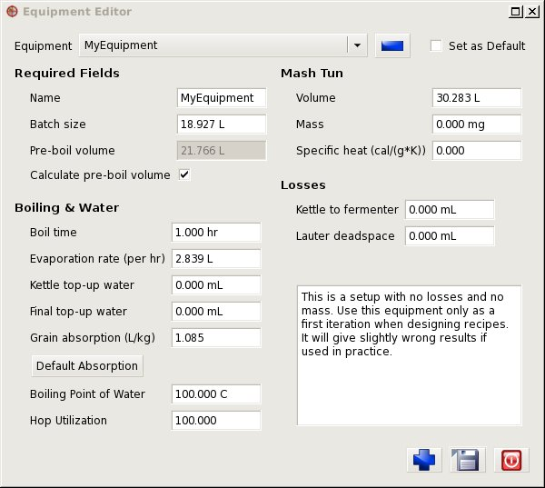

=== Making a New Recipe

Click on either File-{gt}"New Recipe", click the blue plus in the
toolbar at the top of the main window or right-click in the recipe tab of the
tree and select "New Recipe". Name your recipe in the box that
pops up, and click "OK".

=== Adjusting Recipe Parameters

If you created your equipment profile as shown above, and you made it the
default profile, you won't need to do anything else.

Otherwise, choose the equipment profile you set up in <<Defining Your Equipment>>
from the Equipment drop-down list. You can also drag it from the tree
on the left and drop it on the recipe. After selecting or dropping the
equipment, you will be asked if you want to set the batch and boil size of the
recipe to that of the equipment. Click "Yes".

=== Selecting the Style

Brewtarget comes pre-loaded with all of the BJCP styles. You can
check your recipe against the guidelines for the particular style you are
brewing. To do this, select "American Amber Ale" from the
Style drop down list

You will notice that the bubbles in the right pane changed.

.Before Style
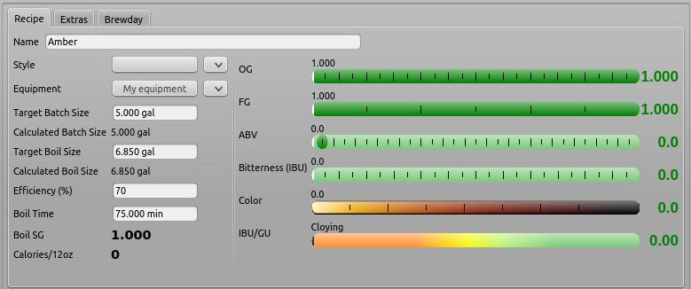

.After Style
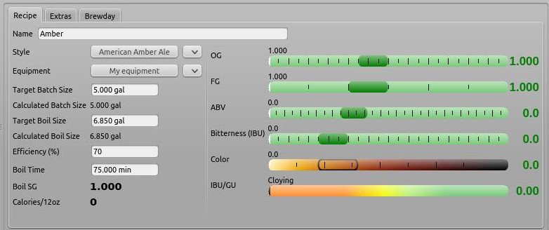

The dark green bubbles show the expected range for the style you selected. The
color bubble shows the expected colors for the style. Since we haven't added
any grains, hops or yeast to our beer yet, they don't show anything else.

=== Adding Ingredients

Open the "Fermentable" tree in the left pane (denoted with a barley icon),

.Fermentable Tree
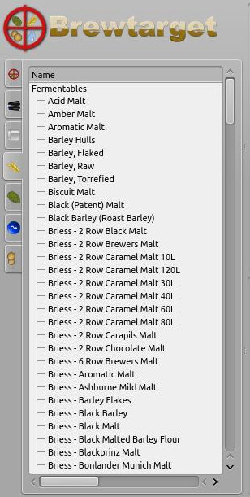

and drag the following items into the Fermentables pane.

* Briess 2 Row Brewers Malt
* Briess Caramel Malt 80L

This is not an endorsement of Briess; they are simply near the top.

In the main window, you will see those two malts in your recipe. Click on
the Crystal 80's "Mashed" checkbox to tell it that we want to have
this in the mash (malt can also be steeped). You should have this:

.Recipe After Fermentables
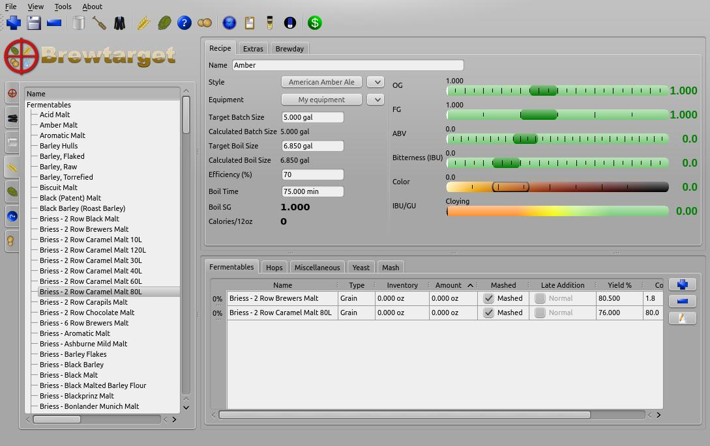

Double-click the 2-row's "amount" cell and enter "4.536 kg". You will see that
it gets converted automatically into "10.000 lb" if you're using US units. For
the Caramel 80, tell it "32 oz". You can change US/English/SI preferences in
Tools-{gt}Options. Please see <<Supported Units>> in this document to see
the correct abbreviation for each unit.

Now you should notice something different about the bubbles in the main
window. The OG bubble now has a white line with "12.2" above it, within the
dark green bubble. This means the OG is within the range defined by the
American Amber style.

The FG, though, is way off to the right of the bubble and nowhere near the
dark green bubble. This means the FG is too high for the style. The ABV is
pegged at zero, far to the right of the "to style" range. We will
fix this once we add a yeast and a mash schedule to the recipe.

The color bubble now has a white line within the "to style" range.

Finally, the IBU/GU meter shows the beer as 0 and cloying. This bubble provides
a general guide on how balanced your beer is.

Now, go to the Hops tab and add 1 oz Cascade at 1 hr, 1 oz Cascade at 15 min,
and 1 oz Cascade at 5 min. The IBUs should be about 33.4, and in the green.

.Adding the hops
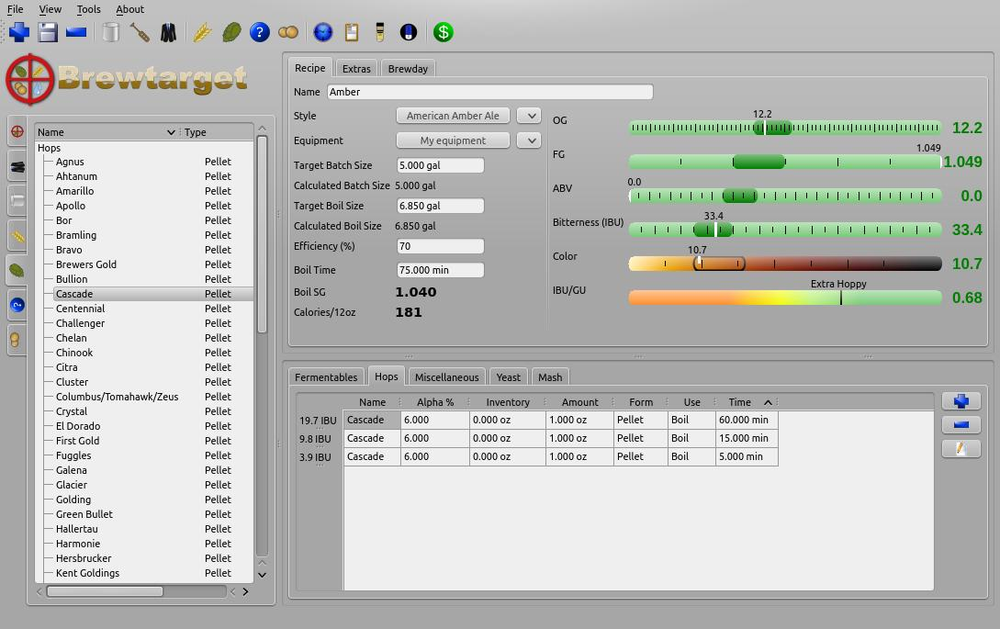

Add WLP001 yeast to the recipe. Now everything should be in the green.

.Adding the yeast
image::afterYeast.jpg[After adding yeast]

=== Making a Mash

Let's do a 2-step mash with a protein rest at 121 F and a conversion rest at 152 F.

IMPORTANT: Until now, Brewtarget has been
*lying* to you. Underneath the target batch size on the main window, it
says your calculated batch size and the calculated boil size are not 0. These
are estimates based on your equipment profile. Brewtarget is lying because
it's convenient just to be able to start adding the ingredients and get an
approximate answer. After setting the mash addition volumes, you will get a
real answer.

Switch to the Mash tab in the main window. Click on "Edit Mash" and
give it a name. You can enter the initial grain temp, sparge temp and initial
tun temp here. Entering these as accurately as possible will give you the best
chance to nail your temperatures. To set tun mass and specific heat, you
should click "From Equipment". 

.Set up the mash
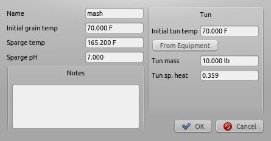

You can save this mash profile by pressing "Save
Mash" at the bottom of the mash tab. It will be saved under the name you
gave it in the "Edit mash" dialog. You can recall a mash profile by
selecting it in the appropriate drop down box. From here, there are two ways
to create the mash.

==== Method 1: Mash Wizard

Go to the mash tab and click the blue plus. Name it "Protein" and
click "OK". 

.Protein step
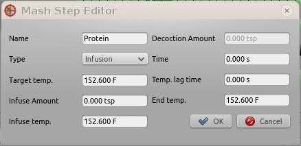

Double click its "Target Temp" cell and change
to "121 F", and change the "Time" to "20 min".
This means we want to hit a target temperature of 121 F for 20 minutes. 

.Protein step
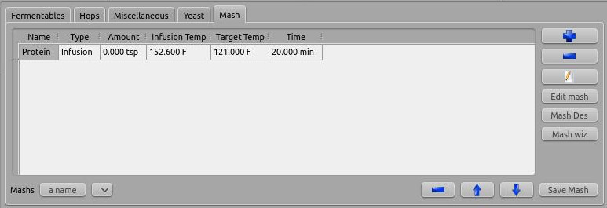

Do the same for a "Conversion" step at "152 F" for "1 hr".

.Conversion step
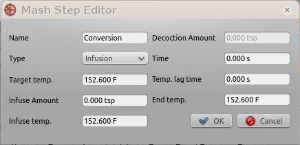

.Conversion step
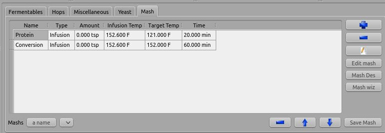

The mash wiz is for quickly and easily getting the correct mash temperatures
and volumes for a single batch sparge mash. Click on the "Mash wiz"
button, and give it a mash thickness of 1.25 qt/lb (or 2.6 L/kg).

.Mash wizard
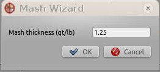

When you select "OK", the mash wizard does 3 things for you:
calculated infusion volumes, infusion temps, and gave you a sparge step that
will make you hit your pre-boil volume.

.Mash wizard results
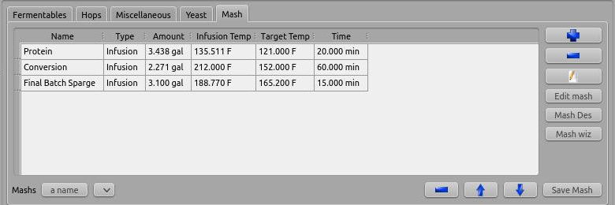

Now Brewtarget is not lying anymore about the calculated boil volume and batch
size. You can see any of the infusion temperatures under the "Infusion
Temp" column. 

IMPORTANT: You don't have to actually sparge with all of the sparge
water, but can put a portion directly into the kettle depending on how you
like to sparge. You can also split the sparge water into multiple sparge
batches. Fly sparging should understand the "final batch sparge" to
indicate the volume of sparge water they should collect.

IMPORTANT: Since your equipment and recipe might change, you should
always do the mash wizard after recalling a saved mash profile.

==== Method 2: Mash Designer

The mash designer is for more advanced use. It can be used to create any mash
schedule you desire with however many sparges, and at whatever infusion temp
or volume you desire. To start it, just click the "Mash Des" button.
A dialog will ask you for the temperature of the tun before the first infusion,
so enter 70 F and continue.

.Mash designer start
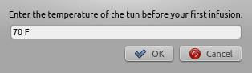

We are now looking at the parameters for the first infusion. Enter "Protein" for the name,
leave the type at "Infusion", enter "121 F" for "Target temp.", and
"20 min" for the time. Now, you can either move the infusion/decoction amount slider OR
the infusion temp slider. Moving one will cause the other to move so that the combination of
amount and infusion temp causes you to hit 121 F. The upper and lower limits of these sliders
are based on the maximum available space left in the tun (as given by the current equipment), and
the boiling temperature of water. Start the amount slider at the far left. You will see that the
tun fullness meter on the right shows an infusion ratio of 0.11 qt/lb which is far too low. How
do I know it's too low? The total collected wort meter shows a negative value, meaning that the grain
will absorb all of the infusion's water and could absorb more. So, slowly move the amount
slider until the infusion ratio reaches about 1.25 qt/lb.

.Mash designer protein rest
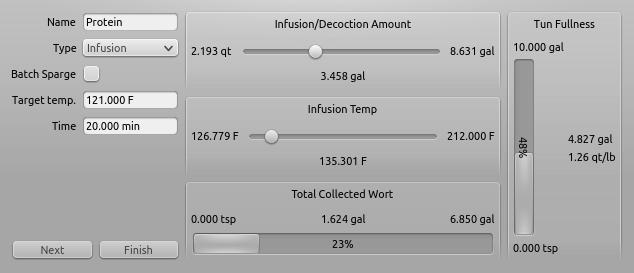

You should see that the tun is about half full, and we have reached 1.9 gal of the 6.25 gal that we
plan to collect pre-boil. Click "Next". 

Name this step "Conversion" and set the target temp to 152 F and the
time to 1 hr. Slowly move the temp slider all the way to 212 F.

.Mash designer conversion step
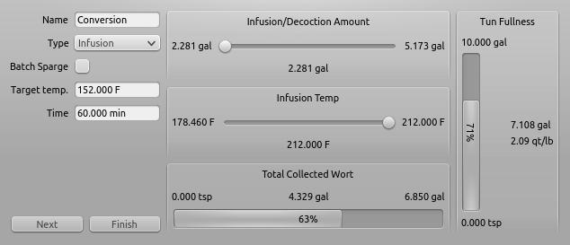

Click "Next". Name this step "Batch Sparge". Click the "Batch Sparge"
checkbox, set the target temp to 165 F, and the time to 15 min. You will
notice that the tun fullness has gone down, simulating that you have drained
the tun of liquid; this is the purpose of the checkbox.  Move the amount
slider slowly to the right until the total collected wort reaches about 6.25
gal.

IMPORTANT: If you exceed the target collected wort volume, the
progress bar will still show 100 percent, so be careful and pay attention to
the text which shows the actual collected wort.

.Mash designer
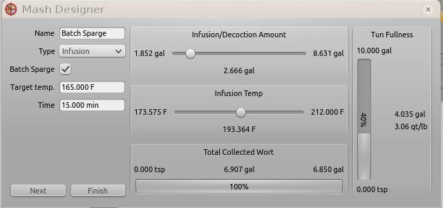

Finally, click "Finish" to return to the main window.

.Mash designer finished
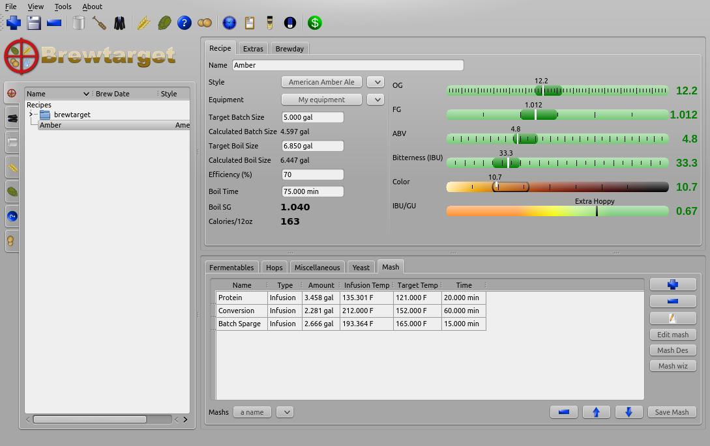

*Congratulations!* You have just created your first recipe with Brewtarget!

=== Brewday Mode

Now that your recipe is all planned, wouldn't it be good to have some instructions on your
brewday? Click the "Brewday" tab at the top of the main window. Click "Generate Instructions".
It has made all instructions for you and listed them on the left in order.
You can remove, shift up/down, insert, change steps as you see fit to help you be organized
on your brew day.

There are 3 timers to help you with time-critical steps if you click the clock
button in the toolbar of the main window. They are in HH:MM:SS format, and the
text box above each one is what you use to set it. Just enter "1:00:00" and
press "set" to set the timer for 1 hour, for example. The "Sound" button allows
you to select a sound that will be played when the timer reaches zero.
Brewtarget has provided many default sounds to choose from, or you can select
any other sound file on your computer.

=== Printing the Recipe

Print and print preview are available under the "File" menu. There are two
printouts available. One is "Recipe" and the other is "Brewday". The recipe
printout is all the info related to the recipe you have made. The brewday
printout is formatted in organized specifically for following when you brew.

=== Saving Your Work

When you close Brewtarget, you will be given an option to either save or
discard your work.
