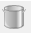
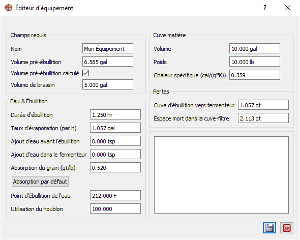

=== Établissement de l'équipement

IMPORTANT: La conception d'une bière nécessite un équipement configuré.

Le système Brewtarget permet l'obtention d'une multitude d'information qui seront propre à votre équipement. Conséquement, deux configurations différentes produiront deux recettes différentes. C'est pourquoi il est si important que vous y configurez **votre** équipement.

La création ou l'ajustement d'équipement se fait dans le menu équipement. Ce menu est indiqué par l'icone 

Vous pouvez trouvez cet icone à trois endroits : 

1. Menu supérieur : ``Visualiser -> Équipements``
2. Barre d'outils, l'icone devrait y être directement visible.
3. L'espace d'exploration gauche aura un onglet pour la vue de l'équipement.

Pour les options 1 et 2, le menu équipement ouvriera et vous devrez pressez le ``+`` bleu en bas de la fenêtre pour créer un nouveau profil. Pour la dernière option, un click droit et ``Nouveau``.

.Champ Requis
[cols="<25,<75a", options="header"]
|==============================================================================
|Champ
|Description

|Nom
|L'identifiant à utiliser pour votre équipement.

|Volume pré-ébullition
|Quantité de moût dans le chaudron immédiatement avant le début de l'ébulition.

|Volume pré-ébullition calculé
|Laissez Brewtarget déterminer le volume pré-ébulition en fonction du volume de l'équipement et des pertes envisagés.

|Volume de brassin
|La quantité de moût voulut au début de la fermentation.
|==============================================================================

.Eau & Ébulition
[cols="<25,<75a", options="header"]
|==============================================================================
|Champ
|Description

|Durée d'ébullition
|La durée habituelle d'ébulition pour vos recettes. Typiquement 60 min.

|Taux d'évaporation (par heure)
|Taux d'évaporation de l'eau durant l'ébulition par heure. Dépend de la force de l'ébulition et de si le chaudron est recouvert. Typiquement autours de 3L ou 0.75 US Gal.

|Ajout d'eau avant l'ébulition
|Quantité d'eau ajouter lors du passage de l'empatâge à l'ébulition. *Important :* Pour une recette sans empatâge, c'est la quantité totale d'eau utilisé.

|Ajout d'eau dans le fermenteur
|Quantité d'eau ajoutée au moment de passer en fermenteur.

|Absorbtion du grain
|Le grain utilisé lors de l'empâtage et de la mascération absorberont du liquide qui sera perdu de la recette. Utilisez la configuration par défault en cas d'incertitude.

|Point d'ébullition de l'eau
|Le point d'ébulition de l'eau à votre altitude et pression. Il est recommendé de laisser à sa valeur par défaut si vous n'êtes pas sûr.

|Utilisation du houblon
|Définit un facteur de correction pour l'utilisation du houblon. La valeur par défaut est de 100% mais si vous avez un système particulier et assez d'expérience pour savoir que système produit une utilisation plus élevée, vous pouvez ajuster Brewtarget à l'aide de ce facteur de correction.

|==============================================================================

.Cûve d'empâtage
[cols="<25,<75a", options="header"]
|==============================================================================
|Champ
|Description

|Volume
|Volume maximal de la cûve.

|Masse
|Masse de votre cûve. Au niveau de la mer, équivalent à son poids.

|Chaleur Massique
|Chaleur massique du matériel de votre cûve en cal/(g*C). Valeures typiques :

* Aluminum - 0.215
* Copper - 0.092
* Iron/Steel - 0.108
* Plastic - 0.359
|==============================================================================

.Pertes
[cols="<25,<75a", options="header"]
|==============================================================================

|Chaudron au fermenteur
|Perte de liquide lors du transfert suite à l'ébullition.

|Espace mort "cuve-filter"
|Combien de liquide sera perdu dans l'espace au fond de votre cuve d'empâtage.

|==============================================================================

Lorsque terminé, appuyé sur sauvegarer en bas de la fenêtre pour rendre cet équipement persistant. Voici la configuration suggéré pour ce tutoriel :

.Profile d'équipement

