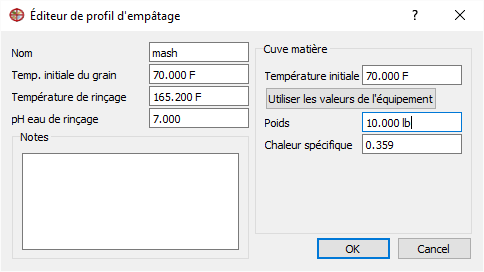
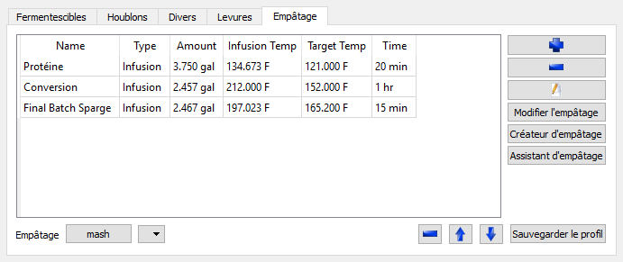
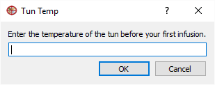
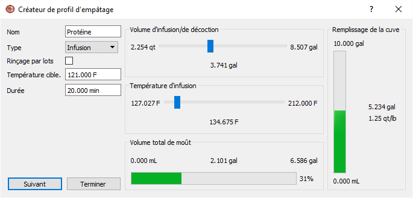
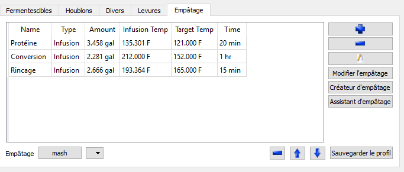

=== Planification de L'empâtage

Débutons par la planification d'un empâtage à deux étapes; un repos protéinique à 121F et un repos de conversion à 152F.

IMPORTANT: Jusqu'à maintenant, Brewtarget a utilisé les volumes configurés dans votre équipement pour le calcul des volumes produit. Lors de la planification de l'empâtage, cette valeur sera ajusté.

Sélectionnez l'onglet ``Empâtage`` dans l'éditeur de recette. Pressez ``Modifier l'empâtage`` et donnez lui un nom. Entrez ici la température de votre grain, la température de l'eau de lavage, et et la température de votre cuve d'empâtage. Plus vous pouvez donner de précision dans ces valeurs, plus vos chance de succès son haute.

.Configuration

Sauvegarder ce profil d'empâtage vous permetera de le réutiliser pour créé des empâtages.

==== Méthod 1: Assistant d'empâtage

Dans la fenêtre d'empâtage, cliqué le ``+``. Nommez l'étape "Protéine" et pressez ``ok``. Double cliqué sur la cellule ``Target Temp`` et entrez ``121 F`` et changez la durée pour ``20 min``. Nous indiquons donc à Brewtarget que nous voulons conserver cette température pour 20 min. 

Répétez l'étape précédante pour la création d'une étape de *Conversion* à ``152 F`` pour ``1 hr``.

À ce point, nous avons indiqué au logiciel les étaps générales que nous tentons d'éffectuez, mais nous ne connaissons pas encore les particularités de quelles température et combien d'eau sera nécessaire. Pour ce faire, nous devons activé l'assistant avec les étapes déjà entrés. Pour ce faire nous devons presser le button ``assistant d'empâtage`` et lui donner un ``Mash Thickness`` ou épaisseur d'empâtage. Cette valeur définit le rapport eau / grain du procédé. Utilisez ``1.25 qt/lb``.

Lors de l'utilisation de l'assistant, trois actions seront appliqués :

1. Les volumes d'infusions.
2. Les températures d'infusions.
3. Ajout d'une étape finale pour l'obtention du volume pré-ébullition.

.Configuration Finale

Le volume d'ébulition calculé et le volume de fermentation sont maintenant ajustés. Les températures d'infusion sont maintenant indiqués dans le plan d'empâtage.

IMPORTANT: Le ``Final Sparge`` indique combien d'eau vous aurez à ajouter avant l'ébullition. Vous pouvez donc décidé d'en utiliser moins pour le lavage et l'ajouter directement au chaudron.

IMPORTANT: Votre empâtage devra être refait après toute modification à l'équipement.

==== Method 2: Créateur d'empâtage

Le créateur d'empâtage est conçu pour un usage avancé. Il peut être utilisé pour la création de tout plan d'empâtage avec un nombre illimité de rincage, et une température d'infusion ou un volume désiré.

Débutons en presant ``Créateur d'empâtage``. Un dialog vous demandera la température de première infusion. Utilisons ``70 F``.

.Début Conception Empâtage

Nous sommes maintenant présenté les paramètres de la première infusion. Entrez ``Protéine`` comme nom, laissez le type à ``infusion``, entrez ``121 F`` comme _température cible_, et entrez ``20 min`` comme durée.

Vous entrez maintenant en mode intéractif. À ce point, nous cherchons à impartir au grain une quantité de chaleur. Donc toute addition est un compromis entre peu d'eau très chaude ou plus d'eau moins chaude. C'est pourquoi vous pouvez, dans ce mode, *SOIS* utilizer le control de quantité d'eau, ou le control de température et les autres valeurs seront calculés pour vous.

Les extrémums de ces échelles sont basés sur l'espace restant dans la cûve. Débutez par le contrôle de quantité. Avant même de l'actionner, vous pouvez voir que l'indicateur de remplissage de la cûve indique 0.11 qt/lb en indication de _mash thickness_ ce qui est bien trop bas. Comment savoir si c'est trop bas? L'indication de moût collecté indique présentement un volume total de moût négatif, voulant dire que le grain va absorver tout l'eau et pourrait en absorber encore plus. Déplacer donc le contrôle jusqu'à atteindre 1.25 qt/lb.

.Repos Protéinique

À ce point, vous devriez voir que votre cûve est mi-pleine. Cliqué sur ``Suivant``.

Répétez le procédé pour cet étape *Conversion*, avec une _temperature cible_ à ``152 F``, une _durée cible_ à ``1 hr`, et une température d'infusion (l'autre contrôle) à ``212 F``.

Finalement, une dernière étape nommé *Rincage*. Sélectionné la case ``Rincage par lots``, et ajustez la _température cible_ à ``165 F`` et le durée à ``15 min``. Vous remarquerez que la quantité d'eau représenté dans la cûve à diminué. Ceci indique que cette étape à retiré une partie de la phase acqueuse de la solution, c'est la function de la case ``Rincage par lots``. Déplacez légèrement le contrôle de quantité jusqu'à ce que la quantité de moût collecté atteigne ``6.25 gal``

IMPORTANT: Si vous excédé la quantité de moût cible, la barre de progress indiquera toujours 100%. Portez attention à la valeur réel indiqué.

Finalement, pressez ``Terminer`` pour retourner à la fenêtre principale.

.Fin du concepteur d'empâtage

*Félicitation!*
Vous venez de compléter votre première recette avec Brewtarget!