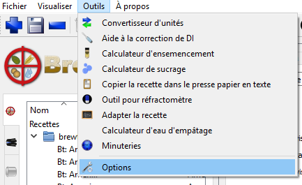
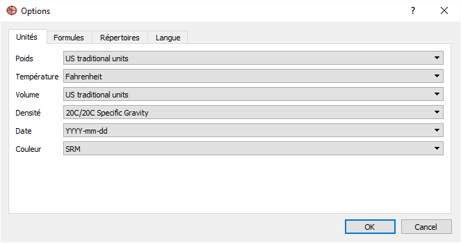

=== Options générales

Avant de débuter, il vous faut ajuster le logiciel à vos préférences pour que vous puissiez facilement vous y retrouver. Les options et préférences de Brewtarget ce trouvent dans :  ``Outils -> Options``.

.Sélectionnez Options

C'est ici que vous configurerez entre-autre, le système d'unités à utiliser, les heuristiques (règles de pouce) à utiliser, et d'autre paramètres qui influenceront comment le logiciel intéragiera avec vous. Pour les fins de ce tutoriel, et par souci de concision, nous présenterons toutes les instructions et les imprimés écrans seront en ``US Traditional``, la température sera en ``Farhenheit``, la gravité en ``gravité spécifique`` et la couleur en ``SRM``. Vous devriez avoir cet écran :

.Unités

[IMPORTANT]
Une configuration utilisant les degrees Plato implique que la gravité final (FG) présenté ne sera **pas** corrigé. La gravité finale reflétera donc l'actuelle gravité finale et non ce que vous lirez sur un réfractomètre.

Dans l'onglet Formules, configurez la _couleur_ à **Morey's** et _IBU_ à **Tinseth**.