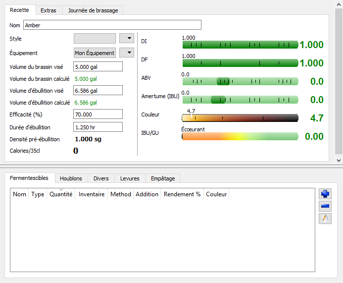
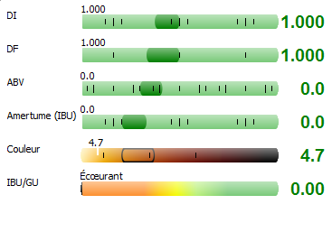
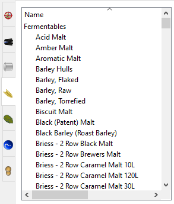
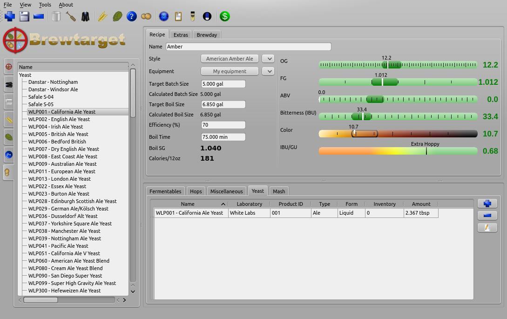

=== Création d'une recette

Commencez par cliquez sur l'icone nouvelle recette :  Entrez ensuite le nom de votre recette et pressez ``OK``. 

NOTE: Vous pouvez aussi utiliser ``File -> New Recipe`` ou dans l'onglet d'exploration de recette dans la fenêtre de gauche.

Suite à la création de la recette, vous serez présenté devant un écran de création de recette. Cet éditeur sera le centre de toute les modifications, les ajouts, et ingrédients de votre recette. Vouz pourrez aussi y voir un estimé de certaines de ces caractéristiques et leur conformités par rapport à un style.

.Éditeur de recette

==== Équipement
Vous pouvez voir que dans cet impression écran, ``Mon Équipement`` est sélectionné par défaut. Cet équipement a été configuré dans la section link:01/equip.adoc[Établissement de l'équipement]. Si vous ne l'avez pas déjà fait, faites-le maintenant.

==== Style

Tous les styles officiels du BJCP sont offert par défault dans Brewtarget. Ils vous est donc facile de configurer votre recette de manière à ce que vous sois indiqué les valeurs de référence du style voulu. Puisque nous essayons de faire une _American Amber Ale_, sélectionnez ce style dans l'éditeur.

Vous noterez que l'écran de visualization rapide à changé et présente maintenant les tranches optimales pour chancune des échelles présentés.

.Style avec tranche

Les bulles vertes foncés représentes les tranches de l'échelle recommendé par le style. Puisqu'aucun ingrédient n'a été ajouté à ce point, nous ne respectons aucune des valeurs.

==== Ajout d'ingrédient

Sélectionnez l'explorateur de fermentiscible dans la fenêtre de gauche. Les produits fermentiscible sont représenté par l'icone : .

Vous devriez voir ce type de résultats et d'élément. Ces éléments sont les ingrédients fermentiscibles qui sont prêt à être inséré dans une recette.

.Fermentiscible

Glissez et déposer ces items dans la fenêtre d'éditeur de recette.

* Briess 2 Row Brewers Malt
* Briess Caramel Malt 80L

Dans l'éditeur de recette, vous verrez maintenant les deux malts. Choisisez les deux items, et configurez les en mode ``Mashed`` qui signifie _empâté_.

NOTE: L'utilisation de produit de Briess est pour une question alphabétique.

Double cliqué ensuite sur la cellule "Amount" du 2-rang et entrez ``4.536 kg``. Vous remarquerez que le logiciel convertira automatiquement cette quantité à notre configuration en unité US de ``10 lb``. Pour le Caramel 80, entrez ``32 oz``. Vous pouvez à tout moment changer votre configuration d'unités dans la section link:01/option.adoc[Options générales]. Référez à la section _Unité Supportées_ pour plus d'information sur les abbréviations supportés (aucune pluralization).

Vous noterez maintenant que la valeur de DI (densité initiale) respecte maintenant le style choisit. La DF (densité finale) est cependant bien au delà de l'échelle permise puisqu'aucune levure n'a été sélectionnée pour fermenter les sucres.

De plus, le ABV (alcool par volume) est à zéro, pour aucune fermentation et l'échelle IBU/GU présent 0 qui indique une balance sucre/amertume completement porté du coté sucre.

Sélectionnez maintenant l'onglet houblons dans l'explorateur définit par l'icone : .

Houblons::
Répétez les étapes de glisser-déposer et de configuration de la quantité pour :

* 1 oz Cascade at 1 hr
* 1 oz Cascade at 15 min
* 1 oz Cascade at 5 min

L'IBU devrait maintenant indiquer ~34 et être dans les normes.

Levure::
Ajouté la levure WLP001 prise dans l'explorateur de levure.

.Adding the yeast
